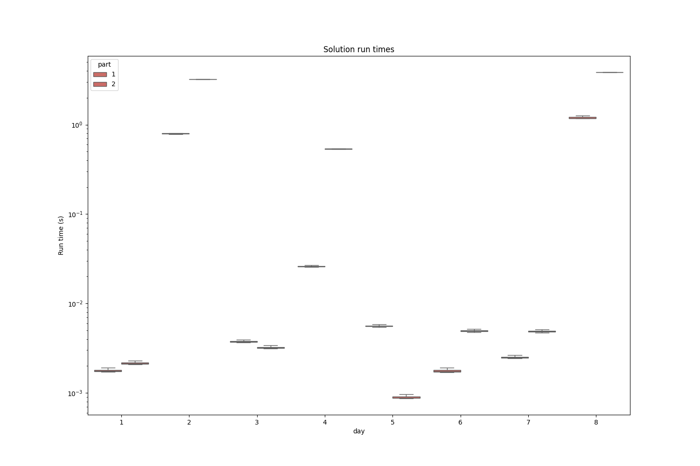

# AdventOfCode2024
Solutions to Advent of Code 2024 with Python and using Pytest.

Also includes a template folder to generate templates for solutions using the run.

For example, `python templates/template_generator.py 5` would create all files for day 5 of the AOC.

# Runtime illustrations

